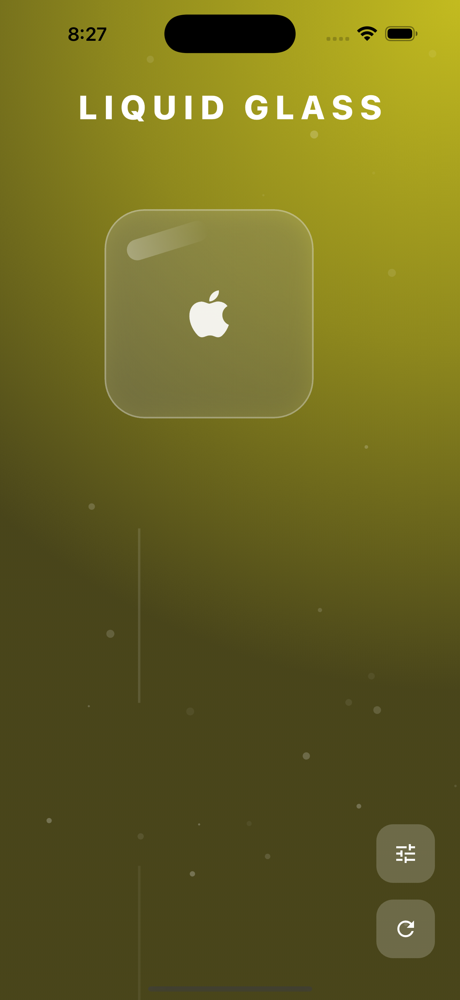
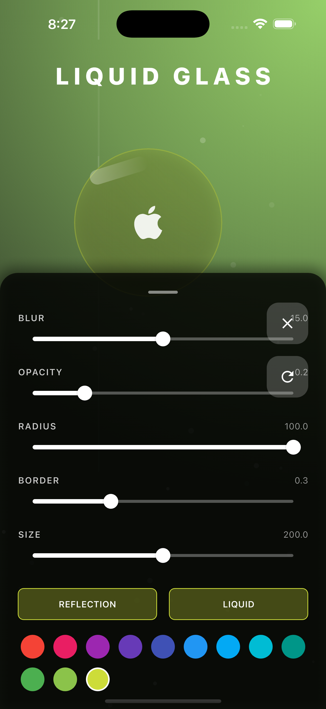

# Flutter Glass Effect Demo

A beautiful Flutter application that demonstrates a customizable glass morphism effect with interactive light beams and particles. This project showcases advanced custom painting, animation, and interactive UI elements in Flutter.

## ✨ Features

- 🌟 Interactive light beam effects
- 💫 Dynamic particle system
- 🎨 Customizable glass morphism properties
- 🎛️ Real-time control panel for effect adjustment
- 📱 Responsive design that works across different screen sizes

## 📱 Screenshots

### Home Screen



### Control Panel



## 🚀 Getting Started

### Prerequisites

- Flutter SDK (Latest Version)
- Dart SDK (Latest Version)
- iOS Simulator/Android Emulator or Physical Device

### Installation

1. Clone this repository:

```bash
git clone https://github.com/yourusername/glass_effect.git
```

2. Navigate to the project directory:

```bash
cd glass_effect
```

3. Install dependencies:

```bash
flutter pub get
```

4. Run the app:

```bash
flutter run
```

## 🛠️ Project Structure

The project is organized into several key directories:

- `lib/models/` - Contains data models for light beams, particles, and settings
- `lib/painters/` - Custom painters for rendering glass effects and particles
- `lib/screens/` - Main application screens
- `lib/widgets/` - Reusable UI components

## 🎮 Controls

The control panel allows you to adjust various aspects of the glass effect:

- Light beam intensity and direction
- Particle density and speed
- Glass opacity and blur
- Color and effect settings

## 🔧 Technical Details

This project demonstrates several advanced Flutter concepts:

- Custom painting and canvas manipulation
- Particle system implementation
- Interactive UI controls
- Real-time animations
- State management
- Custom widget development

## 📄 License

This project is licensed under the MIT License - see the LICENSE file for details.

## 🤝 Contributing

Contributions, issues, and feature requests are welcome! Feel free to check [issues page](#).

## 👨‍💻 Author

Your Name

- GitHub: [@yourusername](https://github.com/yourusername)

## ⭐️ Show your support

Give a ⭐️ if this project helped you!

---

Built with ❤️ using Flutter
